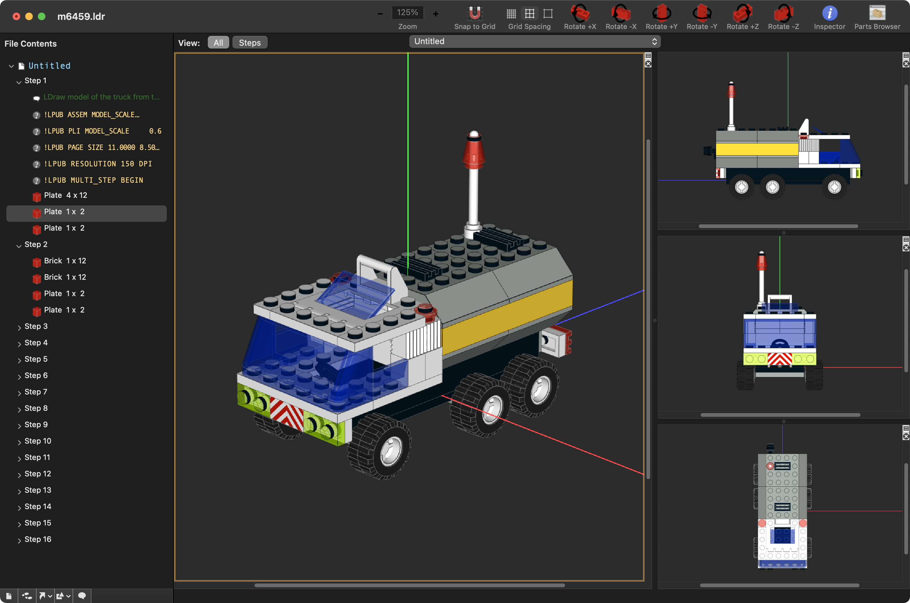

# Bricksmith

This repository contains my personal fork of [Allen Smith's](https://github.com/allenmonroesmith) superb [Bricksmith](https://bricksmith.sourceforge.io) application.  Bricksmith is a fantastic and productive tool for building LEGO models on macOS based on the popular [LDraw](https://www.ldraw.org) CAD model format.  It has a long pedigree, but was almost abandoned a few years ago; however, it was generously open-sourced.  Updates to Bricksmith to keep up with changes to macOS SDKs have been a patchy community effort.  However, since early 2021 efforts by [bsupnik](https://github.com/bsupnik) and the [original author](https://github.com/allenmonroesmith) have made it possible to build Bricksmith on modern versions of XCode to run on recent versions of macOS, including 10.14 (Mojave), 10.15 (Catalina), 11.x (Big Sur).  The most up-to-date and supported Bricksmith repo can be found here: [bsupnik / bricksmith](https://github.com/bsupnik/bricksmith)

I was desperate to continue using Bricksmith since I had become so productive using it.  Furthermore, Bricksmith's internal LDraw model renderer has exceptionally good performance, even with massive LDraw models.  I was anxious to make the switch to [Bricklink Stud.io](https://www.bricklink.com/v3/studio/download.page) and therefore  forked the Bricksmith repo a few years ago and made changes myself to keep up with evolving macOS SDK changes, in particular deprecation of support for OpenGL.  Since then, it has grown into a more customized (janky!) version to suit my particular preferences and features.

I have rolled in some changes from the main repo; however, I have deviated too much from the original code to contribute with PRs without major merging headaches.  In any case, I have created this repo for my own sanity and in case anyone is interested in tinkering.

## Customizations

Some (but not all) of my changes/customizations include:
* support for dark mode theme
* axis lines from origin in all viewers
* different LDraw syntax highlights in model tree view (with differentiation of submodels vs. parts)
* different style for parts browser
* menu command to insert step at current step (rather than append to the end)
* navigating the tree view in step mode also changes the current step
* almost all math computation converted to double precision floating point
* favorite colour list added to colour picker inspector with a button to mark favorite colours

## References

- [LDraw.org](https://www.ldraw.org) - Official maintainer of the LDraw file format specification and the LDraw official part library.

### Lego CAD Tools

- [Bricksmith](https://bricksmith.sourceforge.io) for macOS by Allen Smith
- [Bricklink stud.io](https://www.bricklink.com/v3/studio/download.page) new and modern design tool designed and maintained by Bricklink
- [LeoCAD](https://www.leocad.org) cross platform tool
- [MLCAD](http://mlcad.lm-software.com) for Windows
- [LDView](https://github.com/tcobbs/ldview) real-time 3D viewer for LDraw models

### LPub Instructions Tools

- Original [LPub](http://lpub.binarybricks.nl) publishing tool by Kevin Clague
- [LPub3D](https://trevorsandy.github.io/lpub3d/) successor to LPub by Trevor Sandy
- [Manual](https://sites.google.com/site/workingwithlpub/lpub-4) for Legacy LPub 4 tool (last version by Kevin Clague)

I hope speak on behalf of the Bricksmith user community to say we owe [Allen Smith](https://allenmonroesmith.bitbucket.io) a debt of gratitude for creating and maintaining Bricksmith in the first place.  He should be truly proud for contributing such a productive and efficient tool to the macOS user community!